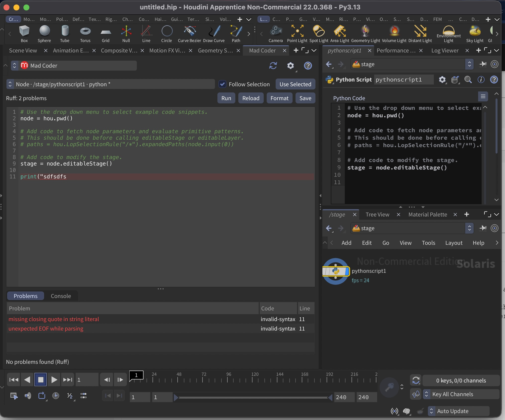

# Mad Coder


Mad Coder is a dockable Python and VEX editor for SideFX Houdini with Python autocomplete, live
Ruff linting, ty type diagnostics, VEX syntax checking, and formatting. It edits the current
scene's `hou.session` module, tagged Python and VEX parameters on selected nodes, and the
`PythonModule` and `ViewerStateModule` sections of selected Houdini digital assets without modifying
Houdini's internal editor widgets.



## Features

- Native dockable Python Panel built with Houdini's bundled PySide6
- Python syntax highlighting, line numbers, automatic indentation, and persistent font settings
- Context-aware Python and Houdini autocomplete powered by Jedi
- Debounced Ruff linting that never blocks Houdini's UI
- Background Python and Houdini API type checking powered by ty
- Native VEX Wrangle syntax checking powered by Houdini's `vcc`
- Full-line error/warning highlights with precise underlines and hover text
- Navigable Problems list
- Ruff formatting
- Built-in console for captured `print`, standard error, logging, and tracebacks
- Context-aware Run action for scene, node, HDA, and Python Viewer State code
- Save and reload shortcuts
- Protection against overwriting changes made through another editor
- Follow Selection mode for opening supported code from the selected node
- View-only handling for locked parameters and non-writable asset libraries
- Syntax-error diagnostics when Ruff is unavailable

## Compatibility

It targets **Houdini 21.0 and newer**, using Qt 6/PySide6:

| Platform | Supported release archive |
| --- | --- |
| Windows 11 x64 | `windows-x64` |
| Linux x64 on a Houdini-supported distribution | `linux-x64` |
| macOS on Apple Silicon | `macos-arm64` |

Python 3.11 is the minimum supported interpreter. This covers Houdini 21's main Qt 6 build and
Houdini 22's Python 3.11 and 3.13 builds. Qt 5 builds, Houdini 20.5 and older, Intel macOS, and
Linux ARM are outside the initial support scope.

## Local development

From a checkout with Python 3.11+, install the pinned checks and run them:

```shell
make install-checks
make check
```

To test directly from the checkout, create
`$HOUDINI_USER_PREF_DIR/packages/mad-coder-dev.json` with the checkout's `mad-coder` directory as
its `hpath`:

```json
{
  "enable": "houdini_version >= '21.0'",
  "show": true,
  "hpath": "/absolute/path/to/mad-coder-houdini-plugin/mad-coder"
}
```

Restart Houdini after adding or changing the package file. Python module changes can usually be
tested with **Reload Interface** in the Python Panel menu.

To create a local development ZIP instead:

```shell
make build-local
```

This creates `dist/mad-coder-0.0.0-dev-macos-arm64.zip` by default. Override `PLATFORM` and
`VERSION` for another target. See [Development](docs/DEVELOPMENT.md) for the full setup and
interactive smoke-test checklist.

## How to install the plugin

1. Download the ZIP matching your operating system from the GitHub Releases page.
2. In Houdini, open **Windows → Python Shell** and evaluate:

   ```python
   hou.getenv("HOUDINI_USER_PREF_DIR")
   ```

3. Close Houdini.
4. Extract the ZIP's contents directly into that preference directory. Allow the archive's
   `packages` directory to merge with the existing one; do not replace the directory.
5. Confirm the resulting layout:

   ```text
   $HOUDINI_USER_PREF_DIR/
   ├── packages/
   │   └── mad-coder.json
   └── mad-coder/
       ├── bin/
       │   ├── ruff[.exe]
       │   └── ty[.exe]
       ├── python_panels/
       └── scripts/python/mad_coder/
   ```

6. Restart Houdini.

Houdini's package system loads the plugin; `houdini.env` does not need to be edited.

### macOS security prompt

macOS may quarantine the bundled Ruff or ty executables and prevent analysis from starting, or
repeatedly delay the editor while checking them. After installing a trusted Mad Coder release, close
Houdini and run this command in Terminal:

```shell
xattr -dr com.apple.quarantine "$HOME/Library/Preferences/houdini/22.0/mad-coder"
```

Replace `22.0` with the Houdini preferences version you installed the plugin into, such as `21.0`,
then restart Houdini. Only remove quarantine metadata from a release you downloaded from a source
you trust.

### Upgrade

Close Houdini, replace the existing `mad-coder` directory with the directory from the new release,
replace `packages/mad-coder.json`, and restart Houdini. Scene files do not
contain a copy of the plugin.

### Uninstall

Close Houdini and remove these two paths:

```text
$HOUDINI_USER_PREF_DIR/packages/mad-coder.json
$HOUDINI_USER_PREF_DIR/mad-coder/
```

Then restart Houdini. Uninstalling does not alter Python or VEX source already saved in `.hip` files.

## Open and use the editor

1. Open a new pane tab and choose **Python Panel**.
2. In the Python Panel interface menu, select **Mad Coder**.
3. Dock the pane and save the desktop layout if desired.

The source selector identifies what the editor is currently showing. An asterisk means the editor
contains unsaved changes.

### Open code from a node

1. Leave **Follow Selection** enabled.
2. Select a Python node or a VEX node such as an Attribute Wrangle in a network editor.
3. Mad Coder opens parameters Houdini identifies as Python or VEX source automatically.
4. If the node is a digital asset with a `PythonModule` or `ViewerStateModule` section, choose it
   from the source selector when you want to edit that embedded module instead.

The last selected node is used when multiple nodes are selected. **Use Selected** performs the same
lookup on demand, which is useful when Follow Selection is disabled. The source selector always
includes **Scene · hou.session**, so you can return to scene-level code at any time.

Mad Coder does not discard an unsaved buffer when selection changes. Save or reload first, then
select the node again or click **Use Selected**.

### Configure the editor

Select **Settings…** in the Mad Coder toolbar, then open the **Editor** section. The settings window
offers autocomplete and type-checking toggles, installed monospaced font families, a 7–32 pt size
control, a live code preview, and **Restore Defaults**. Autocomplete and type checking are enabled
by default. Select **OK** to apply and persist the choices; **Cancel** leaves the editor unchanged.

Mad Coder prefers **Roboto Mono** as its default when that font is installed. It does not bundle the
font, so systems without Roboto Mono use Qt's platform fixed-width font instead, such as Menlo on
macOS or Consolas on Windows. `Ctrl` + mouse wheel remains available for temporary zooming.

### Editing workflow

- Type normally; language-appropriate analysis runs after a short pause.
- Type `.` to open context-aware suggestions, or press `Ctrl+Space` to
  request suggestions explicitly. Use Tab or Enter to accept and Escape to close the popup.
- Hover over an underlined range to read its diagnostic.
- Click a row in **Problems** to jump to its location.
- Select **Format** to apply Ruff formatting to a Python editor buffer. VEX formatting is not
  currently provided.
- Select **Save** to apply the buffer to its current Houdini source.
- Select **Run** to save, execute in the source's Houdini context, and open captured output.
- Select **Reload** to discard the buffer and read the current source again.

Node-parameter changes are grouped as a Houdini undo operation. Saving a `PythonModule` or
`ViewerStateModule` changes the digital asset definition and therefore affects every instance of
that asset. Asset definitions in non-writable libraries and locked node parameters are opened
view-only.

Saving `hou.session` calls Houdini's `hou.setSessionModuleSource`. Houdini makes the new module
contents available immediately, so top-level code executes as part of applying the source. Changing
node or asset code may also trigger cooks or callbacks. Treat scripts from untrusted scene and asset
files as executable code.

If the current source changed elsewhere after this panel loaded it, Save offers three choices:

- **Reload**: discard this panel's buffer and load the external source.
- **Overwrite**: deliberately replace the external source.
- **Cancel**: keep the unsaved buffer while deciding how to merge the changes.

### Run code and view output

Select **Run** or press `Ctrl+Enter` (`Cmd+Enter` on macOS). Mad Coder switches the lower pane to
**Console** and captures synchronous Python standard output, standard error, logging records, and
uncaught tracebacks. **Copy All** copies the complete console history and **Clear** removes it.

Run applies the current buffer before executing it:

- A Python node parameter is saved and its node is forced to cook in the correct Houdini context.
  This preserves behavior such as `hou.pwd()` and geometry-write permissions.
- A VEX parameter is saved and its node is forced to cook, compiling and executing the snippet in
  the node's native context.
- `hou.session` is applied and evaluated by Houdini.
- An HDA `PythonModule` is saved and loaded. Modules that only define functions may produce no
  output until another callback invokes those functions.
- An HDA `ViewerStateModule` is saved and reloaded with Houdini's embedded viewer-state API, making
  the updated state available without restarting Houdini.
- A view-only node source can be cooked without changing its stored code.

Run is not a sandbox or a full debugger. It executes inside Houdini's main process. Long-running or
infinite code can make Houdini unresponsive, and there is no safe way for Mad Coder to terminate
arbitrary Python code. Save the scene before running unfamiliar code.

The console captures synchronous Python output during the Run operation. Native Houdini/C++ output,
subprocess output, and messages emitted later by background threads may still appear only in
Houdini's normal console or Python Shell. This also means output from Viewer State event callbacks
that occur after Run appears in Houdini's Viewer State Browser or Python Shell rather than in Mad
Coder's console.

### Shortcuts

| Action | Shortcut |
| --- | --- |
| Save | Platform-standard Save (`Ctrl+S` / `Cmd+S`) |
| Request autocomplete | `Ctrl+Space` |
| Run and show Console | `Ctrl+Enter` / `Cmd+Enter` |
| Format | `Ctrl+Shift+F` |
| Reload | `F5` |
| Temporarily zoom editor font | `Ctrl` + mouse wheel |

## Autocomplete behavior

Autocomplete runs Jedi in a serialized background worker, so the first analysis of a module does
not block Houdini's UI. Typing a dot requests semantic candidates; after the popup opens, further
typing is filtered locally. `Ctrl+Space` requests candidates at any cursor position.
Disable **Autocomplete** under **Settings… → Editor** to turn off both triggers. The setting is
enabled by default and persists between Houdini sessions.

Release archives include pinned Jedi and Parso versions plus Houdini 21 type stubs. The active
source context is supplied only to the analyzer, allowing completion for Houdini-provided globals
such as `hou` and `kwargs` without inserting imports into saved code. The Houdini stubs also provide
a useful baseline in Houdini 22; APIs added after Houdini 21 may not appear until the bundled stubs
are updated. Dynamic HDA members and dynamically populated `kwargs` values cannot always be
inferred.

Autocomplete uses static analysis and does not execute the editor buffer or inspect live Houdini
objects. If Jedi is unavailable in a source checkout, the editor remains usable; explicit
autocomplete reports how to install the missing runtime dependencies.

Autocomplete is currently Python-only. VEX buffers do not show Jedi suggestions.

## Type-checking behavior

Release archives contain a pinned [ty](https://docs.astral.sh/ty/) executable. Mad Coder runs it in
an asynchronous child process and merges its results into the same inline markers and Problems list
as Ruff. For example, `"some string".notexistingmethod` reports an unresolved attribute.

Type checking is enabled by default. Disable **Type checking** under **Settings… → Editor** to use
Ruff diagnostics only; the choice persists between Houdini sessions. ty receives the same
analysis-only `hou` and `kwargs` context as autocomplete, and uses the bundled Houdini stubs to
check HOM calls such as `hou.node("/")`. No imports or declarations are inserted into saved code.

This is static analysis: dynamically added HDA members, runtime monkey-patching, and dynamically
populated `kwargs` values can produce incomplete results. ty's `unresolved-reference` and syntax
reports are left to Ruff so the Problems list does not show duplicate diagnostics.

To use another ty executable, set this environment variable before Houdini starts:

```text
MAD_CODER_TY=/absolute/path/to/ty
```

The resolution order is explicit environment variable, bundled executable, then system `PATH`.

## VEX syntax-checking behavior

Mad Coder discovers string parameters whose Houdini parameter template declares
`editorlang=VEX`, including Attribute Wrangle snippets. It switches to VEX highlighting and runs
Houdini's own `vcc` compiler asynchronously, displaying compiler errors inline and in Problems.

Wrangle-only attribute bindings such as `@P`, `v@N`, and `i[]@ids` are converted into typed
arguments in a temporary analysis function. The original parameter text is never modified, and
generated line and column positions are mapped back to the editor. Comments and strings are kept
out of binding discovery. The checker compiles but does not execute the VEX buffer or cook the
scene; choosing **Run** explicitly saves and cooks the source node.

`vcc` is supplied by Houdini and is not bundled in Mad Coder's release archives. Mad Coder locates
it through `MAD_CODER_VCC`, `$HFS/bin`, Houdini's executable directory, then `PATH`. To override it,
set this before Houdini starts:

```text
MAD_CODER_VCC=/absolute/path/to/vcc
```

## Linting behavior

Release archives contain a pinned Ruff executable. The editor runs Ruff in an asynchronous child
process with Python 3.11 syntax compatibility and the core `E4`, `E7`, `E9`, and `F` rule groups.
This catches import, name, syntax, and common Python correctness problems without presenting the
hundreds of style rules enabled by Ruff 0.16's expanded defaults.

Mad Coder supplies Ruff with the documented globals for the active Houdini source context. It
recognizes `hou` in scene and Python SOP code, and recognizes both `hou` and `kwargs` in Python
Snippet SOP, HDA `PythonModule`, and HDA `ViewerStateModule` code. These names are configured only
for linting; Mad Coder does not insert imports or alter the saved source.

Ruff runs in isolated mode, so an unrelated `pyproject.toml` in Houdini's working directory cannot
silently change the editor's rules. If Ruff cannot be found, the panel remains usable and reports
Python syntax errors using the standard library parser; formatting is disabled.

To use another Ruff executable, set this environment variable before Houdini starts:

```text
MAD_CODER_RUFF=/absolute/path/to/ruff
```

The resolution order is explicit environment variable, bundled executable, then system `PATH`.

## Troubleshooting

### Mad Coder is missing from the Python Panel menu

- Verify that the package JSON and plugin directory are siblings exactly as shown above.
- Open Houdini's Package Browser and confirm `mad-coder.json` is enabled.
- Start Houdini with `HOUDINI_PACKAGE_VERBOSE=1` to inspect package-loading messages.
- Confirm the Houdini version is 21.0 or newer; the package intentionally disables itself on older
  releases.

### The panel reports “Syntax only”

The bundled Ruff executable is missing, quarantined, or cannot execute. Reinstall the correct
platform archive. On macOS, check the operating system's security prompt; on Linux, confirm the
executable bit was preserved. An explicit `MAD_CODER_RUFF` path can override it.

### The lint badge says “ty unavailable”

The bundled type-checker executable is missing, quarantined, or cannot execute. Reinstall the
correct platform archive. On macOS, apply the security step above. You can also disable type
checking in Settings or provide an explicit `MAD_CODER_TY` path.

### The lint badge says “VEX syntax unavailable”

Mad Coder could not locate Houdini's `vcc` executable. Confirm Houdini defines `HFS`, or set
`MAD_CODER_VCC` to the `vcc` executable from the same Houdini installation. VEX editing and saving
remain available without live diagnostics.

### Python suggestions work but `hou.` suggestions are missing

Release archives include Houdini API stubs, and a normal `hou.` request should show HOM functions
and classes. After replacing Mad Coder files while Houdini is open, fully quit and restart Houdini;
Jedi and Python cache imported packages and stub discovery for the lifetime of the process. If the
problem remains after restarting, reinstall the complete release archive so the
`scripts/python/hou-stubs` directory is present.

### Save fails

Read the status line for the error reported by Houdini. Correct any syntax diagnostic and save
again. Runtime errors can also be reported while Houdini applies or evaluates code.

### The native Python Source Editor and this panel disagree

Unsaved buffers are private to each editor. Save or reload one editor before switching to the other.
This plugin detects changes to the applied `hou.session` source, but it cannot inspect unsaved text
inside Houdini's native editor.

## Current limitations

- Node discovery recognizes Houdini-tagged Python and VEX parameters, common legacy Python parameter
  names, and HDA `PythonModule` and `ViewerStateModule` sections; HDA event-handler sections are not
  yet included.
- Autocomplete and type checking are static and do not inspect live Houdini objects, so dynamic HDA
  members and dynamically populated `kwargs` values may be incomplete.
- VEX analysis currently targets parameter snippets. It does not provide VEX completion, formatting,
  or full standalone `.vfl` file editing.
- There is no refactoring or language-server integration yet.
- Ruff fixes are shown as fixable diagnostics but are not individually applied; Format formats the
  complete buffer.
- The syntax highlighter is intentionally lightweight and is not a full Python parser.
- Run executes synchronously on Houdini's main thread and cannot safely stop an infinite script.

HDA event handlers, external files, quick fixes, and language-server support are natural follow-up
milestones.

## Develop and release

See [Development](docs/DEVELOPMENT.md) for a source installation, tests, and the tag-based release
process. See [Architecture](docs/ARCHITECTURE.md) for module boundaries and extension guidance.

Maintainers can also open **Actions → Release Version → Run workflow** and choose `fix`, `minor`,
or `major`. The workflow calculates and pushes the next semantic-version tag, then builds and
publishes the platform archives.

## License

Mad Coder is released under the [MIT License](LICENSE). Release archives bundle Ruff and ty;
see [third-party notices](THIRD_PARTY_NOTICES.md).
